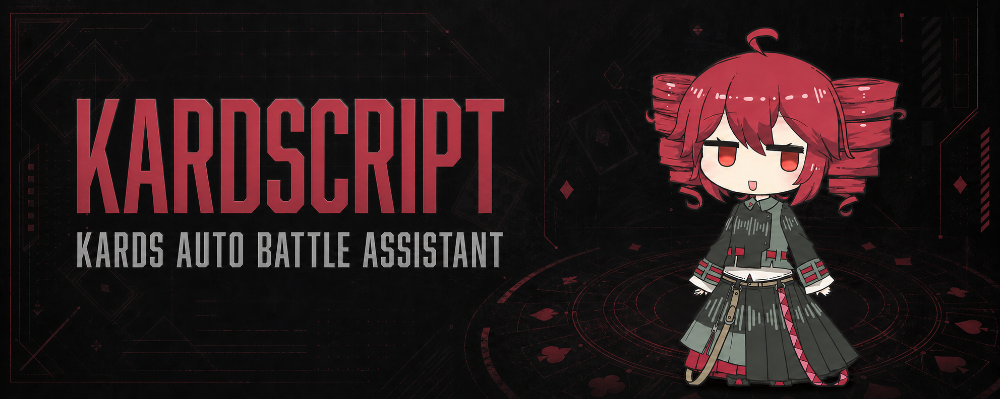

# 🌠 彗星助手（KardsScript）

**KARDS 二战卡牌游戏自动对战挂机工具**



> 💬 QQ 群：**910392625**

> ⚠️ **风险提示**：使用自动化脚本可能违反游戏规则，存在账号被限制、封禁等风险，请务必谨慎评估并自行承担后果。本项目仅供学习和研究使用，项目作者及贡献者不对因使用本项目导致的封号、限制或其他损失负责。

> 🚧 **开发状态**：本项目仍在持续开发中，存在许多尚未发现或修复的 Bug；脚本可能卡住、停止运行或需要手动处理，不保证稳定性和持续挂机能力。

基于 [Auto.js6](https://github.com/SuperMonster003/AutoJs6) 运行时，通过截图权限获取画面，以像素分析 + 模板匹配实现纯视觉自动化；自动模式当前通过 `su`/Root shell 发送 `input touchscreen` 事件驱动 KARDS，不注入游戏进程。调试入口 `autojs/main.js` 当前会调用 `auto.waitFor()`，通常需要开启无障碍服务。

---

## 📋 目录

- [功能概览](#功能概览)
- [APK 安装教程（详细）](#apk-安装教程详细)
- [使用环境与前置条件](#使用环境与前置条件)
- [APK 使用教程（详细）](#apk-使用教程详细)
- [策略配置指南](#策略配置指南)
- [Auto.js6 脚本模式（开发者）](#autojs6-脚本模式开发者)
- [常见问题（FAQ）](#常见问题faq)
- [技术架构](#技术架构)
- [项目结构](#项目结构)
- [已知限制](#已知限制)

---

## 功能概览

| 功能 | 说明 |
|------|------|
| 🎮 自动对局 | 自动启动 → 匹配 → 换牌 → 出牌 → 攻击 → 结算 → 再匹配 |
| 🧠 视觉识别 | 像素亮度/饱和度/边缘密度分析、模板匹配，纯视觉不作弊 |
| 📋 策略 GUI | APK 内置图形化策略编辑器，可直接在手机上调整出牌偏好 |
| 🎛️ 悬浮窗控制 | 暂停/继续/停止一键操作 |
| 🔧 可配置策略 | 训练/休闲/排位模式、出牌优先级、行动上限、操作节奏全部可调 |
| 🛡️ 安全保护 | 页面置信度不足、目标未确认时自动暂停，不会误操作 |
| 📊 实时日志 | 运行日志写入 `/sdcard/KardsScript/logs/`，方便排查 |

---

## APK 安装教程（详细）

### 什么是 APK？

APK（彗星助手）是一个**独立安装包**，内置了 Auto.js6 运行时和自动对战脚本。安装后**不需要额外安装 Auto.js6**，直接打开即可使用。

- **APK 文件名**：`CometAssistant-v1.0.0-notification.apk`
- **包名**：`com.kardsscript.comet`
- **应用名**：彗星助手
- **大小**：约 220 MB（含 OpenCV 视觉引擎和完整脚本）
- **签名**：debug 签名

---

### 第一步：下载 APK 文件

APK 文件位于项目根目录：

```
J:\dev\KardsScript\CometAssistant-v1.0.0-notification.apk
```

将此文件传输到你的电脑或手机上。

---

### 第二步：准备 Android 模拟器（推荐）或真机

#### 方案 A：使用雷电模拟器（推荐）

雷电模拟器对 KARDS 兼容性最好，已验证 1280×720 横屏分辨率完美适配。

1. **下载雷电模拟器**
   - 官网：https://www.ldmnq.com/
   - 推荐版本：雷电模拟器 9.x 或以上
   - 选择 64 位版本（x86_64），与 APK 内置的 native 库匹配

2. **安装并配置模拟器**
   - 打开雷电模拟器后，进入「设置」→「其他设置」
   - 模拟机型必须设置为 **Xiaomi 15 Pro**（Xiaomi 15PRO）
   - 分辨率设置：选择 `1280×720`（横屏），或在自定义分辨率中手动输入
   - 性能设置：CPU 2核 + 内存 4GB 足够运行 KARDS + 彗星助手
   - 开启 ADB 调试：设置 → 其他设置 → 开启「ADB调试」（默认已开启）

3. **在模拟器中安装 KARDS 游戏**
   - 打开模拟器内的 Google Play 商店
   - 搜索 "KARDS - The WWII Card Game"
   - 下载并安装（游戏约 1.2 GB）
   - 或从官网 https://www.kards.com/ 下载 APK 后拖入模拟器安装

#### 方案 B：使用真机

如果使用真实 Android 设备：

1. 确保手机运行 Android 7.0（API 24）或更高版本
2. 开启「开发者选项」→「USB 调试」
3. 手机分辨率建议 1280×720 或更高（16:9 横屏）

---

### 第三步：安装 APK

#### 方法一：直接安装（最简单）

1. 将 `CometAssistant-v1.0.0-notification.apk` 文件**拖入模拟器窗口**
2. 等待安装完成，桌面上会出现「彗星助手」图标
3. 点击图标即可启动

#### 方法二：ADB 命令安装（推荐开发者使用）

打开 PowerShell / 终端，执行：

```powershell
# 如果是雷电模拟器，默认 ADB 地址是 127.0.0.1:5555
adb connect 127.0.0.1:5555

# 安装 APK（-r 允许覆盖安装，-d 允许降级）
adb install -r -d CometAssistant-v1.0.0-notification.apk
```

看到 `Success` 表示安装成功。

#### 方法三：真机 ADB 安装

```powershell
# 确认设备已连接
adb devices

# 安装
adb install -r -d CometAssistant-v1.0.0-notification.apk
```

---

### 第四步：授予必要权限

首次启动时，系统可能会要求以下权限：

1. **截图权限**：彗星助手需要截取屏幕内容来识别游戏界面
   - 弹出权限请求时点击「允许」或「立即开始」
   - 如果错过弹窗，可以去 设置 → 应用 → 彗星助手 → 权限 中手动开启

2. **悬浮窗权限**（可选但推荐）：
   - 部分 Android 版本需要手动授予「显示在其他应用上层」权限
   - 前往 设置 → 应用 → 彗星助手 → 高级 → 显示在其他应用上层 → 开启
   - 此权限用于显示暂停/停止悬浮窗

3. **存储权限**（可选）：
   - 用于读取策略配置文件和写入运行日志
   - 路径：`/sdcard/KardsScript/user-strategy.json`

> ⚠️ **权限说明**：自动模式需要截图权限，并且当前驱动优先通过 `su`/Root shell 发送输入事件，因此需要设备提供可用的 Root/特权 shell；它不注入游戏进程。若运行调试入口 `autojs/main.js`，它当前会调用 `auto.waitFor()`，通常还需要开启无障碍服务。项目不需要 Xposed 框架。

---

## 使用环境与前置条件

### 必须满足的条件

| 条件 | 要求 | 说明 |
|------|------|------|
| Android 版本 | ≥ 7.0（API 24） | Auto.js6 运行时要求 |
| CPU 架构 | x86_64 或 ARM64 | 模拟器推荐 x86_64，真机看芯片 |
| 内存 | ≥ 2 GB 可用 | KARDS 游戏 + 彗星助手需要 |
| 屏幕分辨率 | 1280×720（横屏） | 当前所有坐标和模板基于此分辨率 |
| 游戏 | KARDS 已安装并登录 | 包名 `com.android1939.kardsapk` |
| 网络 | 稳定连接 | KARDS 是在线游戏，断线可能导致对局失败 |

### 推荐环境

| 配置项 | 推荐值 |
|--------|--------|
| 模拟器 | 雷电模拟器 9.x（64位） |
| 模拟机型 | Xiaomi 15 Pro（Xiaomi 15PRO） |
| 模拟器分辨率 | 1280×720 |
| 模拟器性能 | 2核 CPU + 4GB RAM |
| 操作系统 | Windows 10/11（用于 ADB 调试） |
| 图形渲染 | OpenGL 3.0+ |

### 不支持的环境

| 环境 | 原因 |
|------|------|
| Android x86（32位） | APK 内置的 native 库仅含 x86_64 / ARM64 |
| 分辨率 ≠ 1280×720 | 坐标和模板匹配基于此分辨率，其他分辨率会导致误操作 |
| 无 GPU 的模拟器 | KARDS 需要 OpenGL 支持 |
| iOS | 本工具仅支持 Android |

---

## APK 使用教程（详细）

### 1. 启动应用

安装完成后，在桌面或应用列表中找到「彗星助手」图标，点击打开。

你会看到**策略配置界面**（深色金色主题），包含以下可配置项：

```
┌─────────────────────────────────┐
│  🌠 彗星助手                      │
│  KARDS 自动对战控制台     [SAFE] │
├─────────────────────────────────┤
│  策略档案                        │
│  [策略名称输入框]                 │
├─────────────────────────────────┤
│  对局模式                        │
│  (○) 训练模式  ( ) 休闲模式  ( ) 排位模式 │
├─────────────────────────────────┤
│  回合节奏                        │
│  (○) 单位优先  ( ) 出牌优先       │
├─────────────────────────────────┤
│  出牌规则                        │
│  (○) 视觉置信度优先（推荐）        │
│  ( ) 费用高优先                   │
│  ( ) 费用低优先                   │
│  压制敌方前线 [开关]              │
├─────────────────────────────────┤
│  行动上限                        │
│  每回合出牌尝试: (1) (2) (●3)     │
│  每单位行动尝试: (1) (●2) (3)     │
└─────────────────────────────────┘
```

### 2. 配置策略参数

在启动自动对战之前，先根据你的需求配置策略：

#### 对局模式

- **训练模式**（默认推荐）：与 AI 对手对战，适合挂机和测试
- **休闲模式**：与真人玩家对战，不计排名
- **排位模式**：与真人玩家对战，计入段位排名

> 💡 初次使用建议先用**训练模式**，确认一切正常后再切换到休闲/排位。

#### 回合节奏

- **单位优先**（默认）：先操作已上场的单位（移动、攻击），再出新手牌
- **出牌优先**：先打出手牌中的卡牌，再操作已有单位

#### 出牌规则

- **视觉置信度优先**（推荐）：系统自动判断哪张牌最容易安全打出
- **费用高优先**：优先打出费用最高的牌（"大牌先出"策略）
- **费用低优先**：优先打出费用最低的牌（"铺场"策略）
- **压制敌方前线**：开启后，系统会优先清理敌方前线单位

#### 行动上限

- **每回合出牌尝试**：1~3 次（默认 3）
- **每单位行动尝试**：1~3 次（默认 2）

> 🛡️ 这些参数有安全下限，即使你手动修改配置文件，系统也会自动钳制到安全范围。

### 3. 启动自动对战

配置完成后，有两种方式启动：

#### 方式一：点击「保存并启动自动对战」（推荐）

- 保存当前策略配置到 `/sdcard/KardsScript/user-strategy.json`
- 自动启动自动对战脚本
- 显示悬浮窗控制面板（暂停/停止）

#### 方式二：点击「仅保存」

- 只保存策略配置，不启动脚本
- 你可以手动在 KARDS 游戏中操作，脚本会在稍后使用保存的配置

### 4. 悬浮窗控制

启动后，屏幕右上角会出现两个小按钮：

```
┌──────────┬────────┐
│   暂停   │  停止  │
└──────────┴────────┘
```

- **暂停**：点击后暂停自动操作，再次点击恢复
- **停止**：完全停止脚本运行

> ⚠️ 如果悬浮窗权限未授予，这两个按钮可能不可见。不影响自动对战的核心功能。

### 5. 观察自动对战过程

脚本启动后，会自动执行以下流程：

```
HOME → 训练模式 → 选择卡组 → 确认卡组 → 换牌（Mulligan）→ 进入对局
    ↓
┌─→ 我方回合（OUR_TURN）
│   ├── 识别手牌和费用
│   ├── 出牌（拖拽到部署区）
│   ├── 操作单位（移动/攻击）
│   └── 结束回合
├─→ 对方回合（OPPONENT_TURN）→ 等待
└─→ 结算页面 → 继续 → 重新匹配 → 循环
```

### 6. 查看运行日志

日志文件位于模拟器/手机的：

```
/sdcard/AutoJs6/KardsScript/auto-main-log.jsonl
/sdcard/AutoJs6/KardsScript/runs/games-*.jsonl
```

通过 ADB 查看实时日志：

```powershell
# 查看主日志
adb -s 127.0.0.1:5555 shell cat /sdcard/AutoJs6/KardsScript/auto-main-log.jsonl

# 实时监控（每秒刷新）
adb -s 127.0.0.1:5555 shell "tail -f /sdcard/AutoJs6/KardsScript/auto-main-log.jsonl"
```

### 7. 停止并退出

- 点击悬浮窗「停止」按钮，脚本立即终止
- 或者直接按手机/模拟器的 Home 键回到桌面
- 彗星助手进程会在后台被系统回收

---

## 策略配置指南

### 配置文件位置

```
/sdcard/KardsScript/user-strategy.json
```

### 配置文件格式

```json
{
  "schemaVersion": 1,
  "name": "我的策略",
  "actionOrder": ["OPERATE_UNIT", "PLAY_CARD", "END_TURN"],
  "cardPreference": "VISUAL_CONFIDENCE",
  "preferFrontlineUnits": true,
  "maxCardPlaysPerTurn": 3,
  "maxUnitActionAttemptsPerUnit": 2,
  "modeType": "training"
}
```

### 参数说明

| 参数 | 类型 | 可选值 | 说明 |
|------|------|--------|------|
| `schemaVersion` | 数字 | 1 | 策略版本号（固定为 1） |
| `name` | 字符串 | 任意 | 策略名称（用于显示） |
| `actionOrder` | 数组 | `"PLAY_CARD"`, `"OPERATE_UNIT"`, `"END_TURN"` | 行动优先级排序 |
| `cardPreference` | 字符串 | `"VISUAL_CONFIDENCE"`, `"HIGH_COST"`, `"LOW_COST"` | 出牌偏好 |
| `preferFrontlineUnits` | 布尔 | `true` / `false` | 是否优先压制敌方前线 |
| `maxCardPlaysPerTurn` | 数字 | 1~3 | 每回合最大出牌次数 |
| `maxUnitActionAttemptsPerUnit` | 数字 | 1~3 | 每个单位每回合最大行动次数 |
| `modeType` | 字符串 | `"training"`, `"casual"`, `"ranked"` | 对局模式 |

### 通过 ADB 推送配置文件

如果你更喜欢在电脑上编辑策略，可以直接推送：

```powershell
# 创建配置目录
adb -s 127.0.0.1:5555 shell mkdir -p /sdcard/KardsScript

# 推送配置文件
adb -s 127.0.0.1:5555 push user-strategy.json /sdcard/KardsScript/user-strategy.json

# 确认文件已写入
adb -s 127.0.0.1:5555 shell cat /sdcard/KardsScript/user-strategy.json
```

---

## Auto.js6 脚本模式（开发者）

如果你希望直接在 Auto.js6 中运行脚本（而非使用独立 APK），可以使用脚本模式。

### 步骤

1. 在雷电模拟器安装 [Auto.js6](https://github.com/SuperMonster003/AutoJs6)（APK 或 Play 商店）
2. 将 `autojs/` 文件夹推送到模拟器：

```powershell
adb -s 127.0.0.1:5555 push autojs/ /sdcard/AutoJs6/KardsScript/
```

3. 在 Auto.js6 应用中打开 `/sdcard/AutoJs6/KardsScript/main.js`
4. 允许截图权限
5. 切回 KARDS 游戏主界面
6. 点击运行

### 两种运行模式

| 模式 | `config.mode` | 说明 |
|------|---------------|------|
| 观察模式 | `"observe"` | 只识别和记录，不执行任何操作（默认，安全） |
| 自动模式 | `"automatic"` | 完整自动对战（启动、出牌、攻击、结算） |

在 `autojs/lib/config.js` 中修改：

```javascript
config.mode = "automatic";   // 自动模式
config.allowNavigation = true;        // 允许自动导航
config.allowBattleActions = true;     // 允许战斗操作
```

### 离线测试

在开发机上运行单元测试（不需要模拟器）：

```powershell
Get-ChildItem autojs/test -Filter *.test.js | ForEach-Object { node $_.FullName }
```

---

## 常见问题（FAQ）

### Q: 安装后打开闪退？

**可能原因及解决方案：**

1. **Android 版本过低**：需要 Android 7.0 以上
2. **内存不足**：关闭其他后台应用
3. **模拟器不兼容**：尝试更新到最新版雷电模拟器
4. **查看崩溃日志**：

```powershell
adb -s 127.0.0.1:5555 logcat -d | Select-String "FATAL EXCEPTION|abc_vector|UnsatisfiedLink"
```

### Q: 截图权限弹窗看不到？

- 部分模拟器/系统会隐藏权限弹窗，去 设置 → 应用 → 彗星助手 → 权限 → 截屏 → 手动开启
- 或者先手动打开 Auto.js6 的截图权限，再启动彗星助手

### Q: 脚本启动后游戏没反应？

- 确保 KARDS 游戏已安装并登录
- 确保游戏画面处于主界面（HOME）
- 检查日志中是否出现 `HOME` 识别成功的记录

### Q: 分辨率不是 1280×720 怎么办？

- 雷电模拟器：设置 → 其他设置 → 分辨率设置 → 自定义 `1280×720`
- **必须修改为 1280×720**，其他分辨率会导致坐标偏移和误操作

### Q: 为什么我的设备明明也是 1280×720，运行结果仍和开发机不同？

当前兼容契约不只包含分辨率，还包括 Android 版本/DPI、截图权限实现、Root 输入能力、游戏实际前台状态、Auto.js 运行方式、运行目录权限和 KARDS UI 版本。坐标归一化不能自动解决模板缩放、视口留边或输入通道差异。

自动入口启动后会在运行数据目录生成 `environment-report.json`，并记录截图尺寸、设备型号/Android SDK/DPI、当前包名、Root 输入探测和运行目录。只要截图契约或 Root 输入不满足，程序会自动降级为 observe-only，不发送导航或战斗操作；请把该报告和对应时间段的 JSONL 日志一起提供，才能判断是环境阻断、页面识别还是游戏 UI 版本差异。

当前已校准且允许自动操作的环境仍是横屏 `1280×720` + 可用截图权限 + 可用 Root/`input touchscreen`。其他分辨率暂不通过简单拉伸坐标放行，后续需要单独采集模板和手牌/棋盘几何后建立设备 profile。

### Q: 对方回合时脚本卡住了？

- 这是正常行为，脚本会等待对方操作完毕
- 如果等待超过 90 秒对方仍未操作，脚本会自动跳过
- 检查网络连接是否稳定

### Q: 如何查看脚本在做什么？

- 查看日志文件：`/sdcard/AutoJs6/KardsScript/auto-main-log.jsonl`
- 日志中每条记录包含：
  - `screen`：当前识别到的页面
  - `scene`：当前场景（OUR_TURN / OPPONENT_TURN / MULLIGAN 等）
  - `confidence`：识别置信度（0~1，越高越确定）
  - `event`：执行的动作（PLAY_CARD / ATTACK / END_TURN 等）

### Q: 悬浮窗不显示？

- 检查是否授予了「显示在其他应用上层」权限
- 悬浮窗不影响核心功能，只是提供暂停/停止控制

### Q: 游戏更新后不工作了？

游戏 UI 更新可能导致模板不匹配。解决方案：

1. 查看日志中是否出现大量 `confidence: 0` 的记录
2. 等待开发者更新模板，或自行裁剪新模板放入 `autojs/templates/buttons/`

### Q: 能挂机多久？

- 模拟器挂机时间取决于系统内存和性能设置
- 建议定期检查（每 2~3 小时）
- 如遇网络断开，脚本会尝试重连；多次失败后会停止运行

---

## 技术架构

### 视觉识别三层流水线

```
截屏 (captureScreen)
  │
  ├─① 页面分类（KardsUiScreenClassifier）
  │   采样锚点区域的亮度(L)/饱和度(S)/边缘密度(E)
  │   匹配规则：HOME / MODE_MENU / DECK_LIST / DECK_DETAIL / BATTLE / MULLIGAN / RESULT
  │
  ├─② 场景分类（SceneClassifier + 模板匹配）
  │   模板匹配结束回合按钮颜色 → OUR_TURN / OPPONENT_TURN
  │   模板匹配换牌/结算按钮 → MULLIGAN / RESULT
  │
  └─③ 手牌与单位检测
      扇形手牌：按数量动态采样，费用徽章颜色判断可出性
      战场单位：区域分区 + 类型模板 + 守护检测
```

### 输入驱动

| 操作 | 命令 | 说明 |
|------|------|------|
| 点击 | `input touchscreen tap x y` | ✅ 唯一可靠方式（Unreal 引擎专用） |
| 拖拽 | `input swipe x1 y1 x2 y2 duration` | 部分场景有效（出牌拖拽） |
| 普通 tap | `input tap x y` | ❌ 对 KARDS 无效（Unreal 引擎拦截） |

### 决策树 DSL

使用 JSON 声明式策略（禁止执行任意代码），节点类型：

- `priority`：优先选择（按条件权重排序）
- `condition`：条件判断（scene/credits/handCount 等）
- `sequence`：序列执行
- `action`：具体动作（PLAY_CARD / ATTACK / END_TURN 等）

---

## 项目结构

```
KardsScript/
├── CometAssistant-v1.0.0-notification.apk  # 📦 独立安装包（直接使用）
├── autojs/                                  # 🛠️ Auto.js6 脚本工程（开发者）
│   ├── main.js              # 入口：截图循环（750ms/帧）
│   ├── auto-main.js         # APK 自动模式入口
│   ├── launcher.js          # APK 策略 GUI 界面
│   ├── lib/
│   │   ├── config.js        # 核心配置（坐标、阈值、区域）
│   │   ├── domain.js        # 领域模型（Scene/Screen/Action 枚举）
│   │   ├── coordinates.js   # 固定坐标常量（1280×720）
│   │   ├── vision.js        # 视觉引擎（像素采样→场景分类→手牌→单位→目标）
│   │   ├── decision.js      # 决策树引擎（JSON DSL 解析+校验+执行）
│   │   ├── strategy.js      # 策略层（卡牌/单位选择→目标排序→守卫优先）
│   │   ├── driver.js        # 输入驱动（input touchscreen tap）
│   │   ├── runtime.js       # 状态机（场景流转→动作执行→失败处理）
│   │   ├── user-strategy.js # 用户策略读写与安全校验
│   │   ├── floating-controller.js # 悬浮窗暂停/停止控制
│   │   └── carddb.js        # 卡牌数据库查询（按 ID/中文名/英文名）
│   ├── strategy/             # 用户可编辑的决策树 JSON
│   ├── templates/            # 模板匹配图片（按钮、卡牌、单位类型）
│   ├── test/                 # 离线单元测试
│   ├── tools/                # 离线调试工具
│   ├── data/
│   │   ├── carddb.json       # 完整卡牌数据库（1000+ 张卡牌）
│   │   └── carddb-curated.json # 精选卡牌资料
│   └── assets/
│       └── comet-assistant-icon.png  # 应用图标
├── fixtures/                 # 测试截图和坐标数据
├── docs/                     # 项目文档
├── vendor/AutoJs6/           # Auto.js6 源码（构建 APK 用，不入 Git）
└── tools/
    └── add-native-libs-to-apk.py  # APK native 库注入工具
```

---

## 已知限制

1. **项目仍在开发中**：存在未知 Bug，脚本可能卡住、停止运行或需要手动恢复
2. **分辨率锁定 1280×720**：所有坐标和模板基于此分辨率，其他分辨率会误操作
3. **费用 OCR 尚未稳定**：出牌依赖费用徽章颜色（橙色=可出）而非精确数字
4. **7~9 张手牌的动态布局**：扇形手牌在 6 张以内已校准，7~9 张仍需进一步验证
5. **卡牌内容识别有限**：可以识别费用和卡牌类型（步兵/坦克/空军等），但无法读取卡牌名称和详细效果
6. **网络依赖**：KARDS 是在线游戏，断线可能导致对局失败
7. **debug 签名**：APK 为 debug 构建，部分安全软件可能标记为未知来源

---

## 构建与开发

> ⚠️ 以下内容仅面向开发者，普通用户**不需要**执行这些步骤。

### 构建独立 APK

```powershell
# 1. 环境变量
$env:JAVA_HOME='C:\Program Files\Eclipse Adoptium\jdk-17.0.13.11-hotspot'
$env:ANDROID_HOME='C:\Users\User\scoop\apps\android-clt\current'

# 2. Gradle 构建 inrt 变体
cd J:\dev\KardsScript\vendor\AutoJs6
.\gradlew.bat :app:assembleInrtDebug --no-daemon --console=plain

# 3. 注入 native 库（.so 文件）
cd J:\dev\KardsScript
python tools\add-native-libs-to-apk.py `
  vendor\AutoJs6\app\build\outputs\apk\inrt\debug\comet-v<projectVersion>-universal.apk `
  vendor\AutoJs6\libs\jackpal-androidterm-libtermexec-1_0\libtermexec-release.aar `
  CometAssistant-jni-unsigned.apk

# 4. 对齐与签名
C:\Users\User\scoop\apps\android-clt\current\build-tools\36.0.0\zipalign.exe `
  -f -p 4 CometAssistant-jni-unsigned.apk CometAssistant-jni-aligned.apk

C:\Users\User\scoop\apps\android-clt\current\build-tools\36.0.0\apksigner.bat sign `
  --ks C:\Users\User\.android\debug.keystore `
  --ks-key-alias androiddebugkey `
  --ks-pass pass:android --key-pass pass:android `
  --out CometAssistant-v1.0.0.apk CometAssistant-jni-aligned.apk
```

### 安装到模拟器

```powershell
adb -s 127.0.0.1:5555 install -r CometAssistant-v1.0.0.apk
```

---

## 相关文档

- [实机测试报告](docs/hardware-test-report-2026-08-20.md)
- [独立 APK 验收记录](docs/standalone-apk-acceptance-2026-08-23.md)
- [独立 APK 交接报告](docs/standalone-apk-handoff-2026-08-22.md)
- [视觉与目标识别方案](docs/vision-and-targeting.md)
- [决策树 DSL 说明](docs/decision-tree-dsl.md)
- [项目完整概览](docs/project-overview.md)
- [资产清单](docs/assets-inventory.md)
- [卡牌外观校准](docs/card-appearance-calibration.md)
- [休闲/排位节奏验证](docs/casual-ranked-pace-verification-2026-08-23.md)

---

## 许可

本项目仅供个人学习和研究使用。KARDS 是 [1939 Games](https://1939games.com/) 的注册商标。
